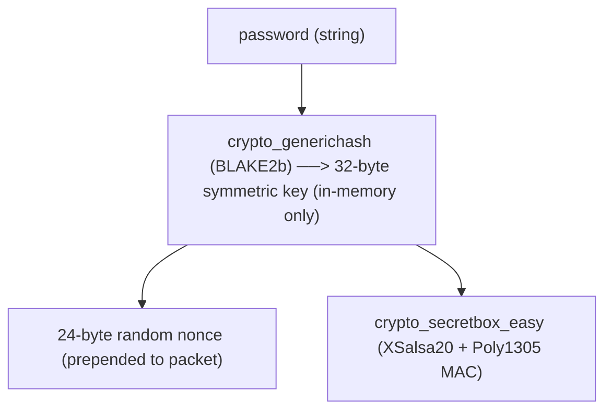

## Offline Mesh Emergency Network (OMEN)

>A decentralized, peer-to-peer UDP mesh network written in C. Devices on a shared subnet form an encrypted communication network with zero external infrastructure, no internet, no central server, no single point of failure.
>
>Built for scenarios where conventional infrastructure fails: natural disasters, grid blackouts, remote field operations.

---

## Architecture

OMEN is a **single-subnet, flat mesh**. Every node communicates directly with every other node via UDP. There is no routing layer ,  all nodes must be reachable on the same subnet (same Wi-Fi, hotspot, or Docker bridge).

Nodes are assigned letters A–Z. The first node to boot becomes Node A (the Genesis Node). Every subsequent node that joins is auto-assigned the next available letter via the bootstrap handshake.

---

## Features

| Feature | Description |
|---|---|
| Auto-discovery | 3-layer bootstrap: Docker subnet broadcast → LAN broadcast → targeted IP fallback |
| Reliable messaging | Application-layer RDT 3.0: stop-and-wait ARQ, alternating 0/1 sequence numbers, 1s timeout, 3 retransmits |
| Broadcast | Fire-and-forget UDP to all known nodes simultaneously |
| Heartbeat + purge | Background thread pings all peers every 5s; nodes silent for >15s are removed from the registry |
| Authenticated encryption | libsodium `crypto_secretbox` (XSalsa20-Poly1305); key derived in-memory via BLAKE2b hash of shared password |
| Dynamic topology | `NET_ADD` / `NET_WELCOME` / `NET_LEAVE` protocol keeps all nodes in sync as peers join or exit |
| Chat history | All sent and received messages appended to `chat_history_<Node>.txt` with timestamps |

---

## How Bootstrap Works

Every node ,  including the first ,  runs the full bootstrap sequence on startup. There are no shortcuts based on a cached `nodes.dat`.

1. Sends `NET_DISCOVER:<port>` (encrypted) to all three targets in order
2. Waits up to 1–2 seconds per layer for a `NET_WELCOME` response
3. **If a response arrives:** parses the full node list from `NET_WELCOME`, registers all peers, and joins as the assigned letter
4. **If no response:** declares itself Genesis Node A and begins listening

`NET_WELCOME` is the single source of truth for topology. A node never assumes its local `nodes.dat` is current.

---

## Cryptography

Every UDP packet ,  including discovery knocks ,  is encrypted before it leaves the socket.



- No key files are written to disk
- Nodes without the correct password cannot decrypt or parse any packet, including `NET_DISCOVER`
- The 16-byte MAC causes any tampered packet to be silently dropped (there is no replay protection yet — a captured ciphertext can be re-sent and will decrypt)

---

## Tech Stack

| Layer | Technology |
|---|---|
| Language | C (C11) |
| Networking | UDP sockets (SOCK_DGRAM) |
| Concurrency | POSIX threads (pthread) |
| Cryptography | libsodium (crypto_secretbox, crypto_generichash) |
| Containerization | Docker + Docker Compose |
| Build | GNU Make |

---

## Build

**Linux / macOS:**
```bash
sudo apt install gcc make libsodium-dev   # Debian/Ubuntu
brew install libsodium                    # macOS
```

```bash
git clone https://github.com/ArushJain-697/omen
cd omen
make build
```

**Windows:** WSL2 is required. OMEN uses POSIX threads and raw UDP sockets.

```powershell
# PowerShell (Admin)
wsl --install
```

```bash
# Inside WSL Ubuntu
sudo apt update && sudo apt install gcc make libsodium-dev
```

---

## Running

### Same machine (two terminals)

```bash
# Terminal 1
./mesh_cli 9001 mysecretpassword

# Terminal 2
./mesh_cli 9002 mysecretpassword
```

### Two machines on the same network or hotspot

LAN broadcast (Layer 2) handles discovery automatically if both machines are on the same subnet. If it fails, use the targeted fallback:

```bash
# Machine 1
./mesh_cli 9001 mysecretpassword

# Machine 2 ,  provide Machine 1's IP explicitly
./mesh_cli 9002 mysecretpassword 192.168.x.x 9001
```

**Mobile hotspot setup:** Enable hotspot on a phone, connect both machines to it, then run the commands above. Find your subnet IP with:
```bash
ip route get 8.8.8.8 | awk '{print $7; exit}'
```

**WSL2 cross-machine note:** WSL2 uses a virtualized network namespace. Find the WSL2 interface IP with `ip addr show eth0 | grep inet` and pass it as the helper address.

### Docker (multi-node on one machine)

```bash
docker build -t omen .

# Node 1
docker run -it --rm --network omen_mesh_net -p 9001:9001/udp -p 9000:9000/udp omen ./mesh_cli 9001 mysecretpassword

# Node 2
docker run -it --rm --network omen_mesh_net -p 9002:9002/udp omen ./mesh_cli 9002 mysecretpassword
```

Docker subnet broadcast (`10.10.0.255`) is tried first ,  no extra configuration needed.

---

## CLI Usage

```
1) Send message
2) Broadcast
3) Exit
Choose:
```

Incoming messages print inline without blocking the prompt:

```
[RECEIVED] From B at 14:32:07: Sector 4 clear, moving to extraction
Choose: _
```

System events:
```
>>> Node C joined via discovery (192.168.1.42:9003)
[SYSTEM] Node D timed out (Ghost Node removed).
>>> Node B left the network
```

---

## Project Structure

```
mesh_cli.c          CLI entry point, receiver thread, menu loop
mesh_backend.c      Node registry, send/recv, heartbeat, ARQ logic
mesh_backend.h      Public API
mesh_discovery.c    3-layer peer discovery, NET_DISCOVER handler
mesh_discovery.h    Discovery API, on_new_peer_fn callback
mesh_crypto.c       libsodium encrypt/decrypt wrappers
mesh_crypto.h       Crypto API
Makefile
Dockerfile
docker-compose.yml
```

---

## Known Limitations

| Limitation | Detail |
|---|---|
| Single subnet only | All nodes must share a subnet. No internet-routed or multi-hop operation. |
| Max 26 nodes | Named A–Z. |
| Stop-and-wait throughput | One in-flight message per sender at a time. |
| No fragmentation | Messages above ~1984 bytes are truncated (2048 buffer minus 40-byte crypto overhead and protocol header). |
| nodes.dat consistency | File writes are mutex-protected in memory but not atomic on disk. |

---

## Roadmap

- Dijkstra-based multi-hop routing to relay messages through intermediate nodes
- Store-and-forward for nodes that join after a message was sent
- Raspberry Pi / Android builds

---

